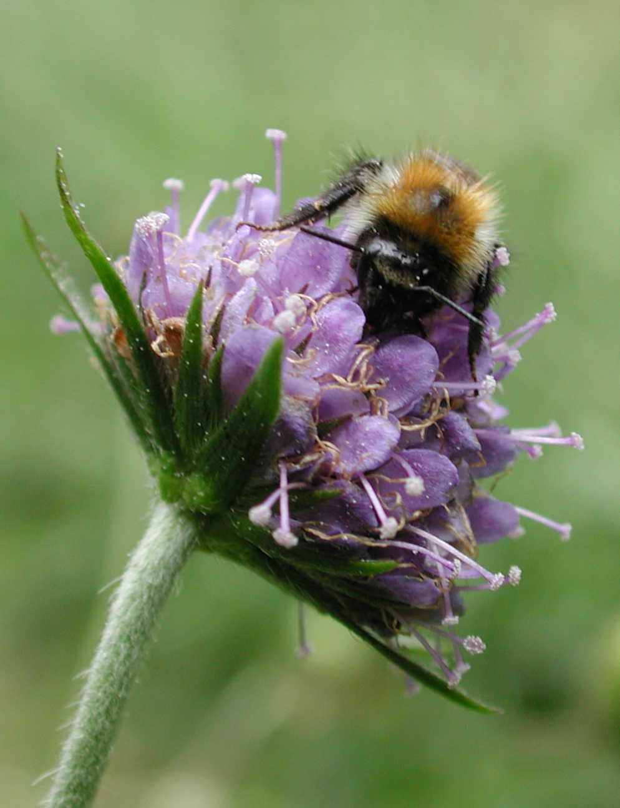
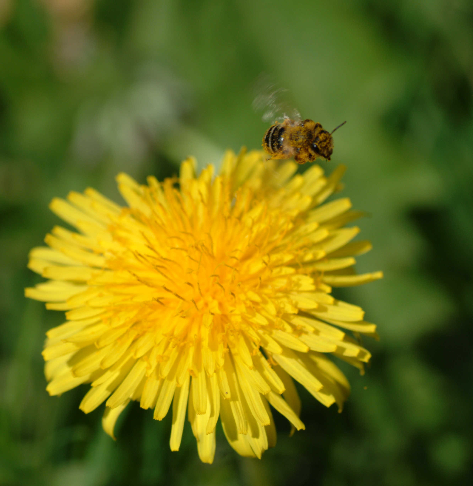

# This is a Header
You may have introductory text, anything in front of the first image will be retained.

 This the caption text!

This text ignored!

Caption Text can go immediatly below the image 

